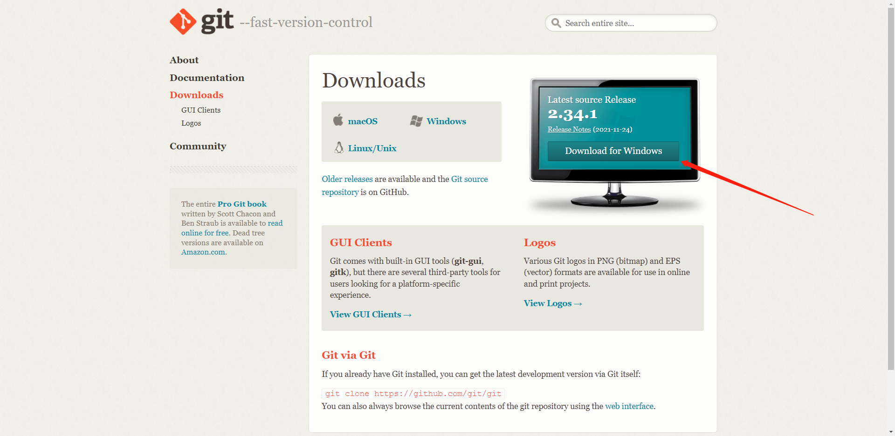
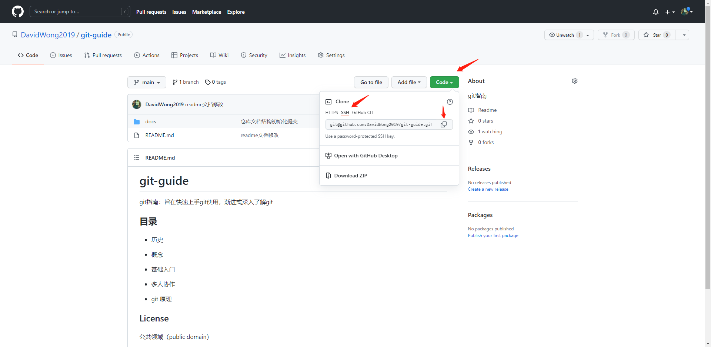
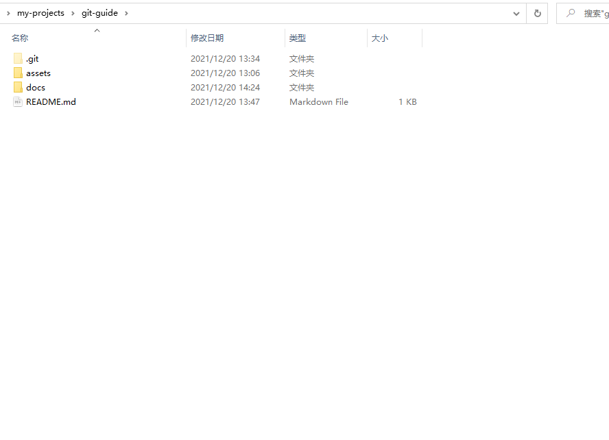

# 快速入门

本文档以本仓库为例子，带领你初次安装并使用 git！

## git 安装

### windows

#### 1. 在官网下载最新的 git 安装包

```text
地址：https://git-scm.com/downloads
```



#### 2. 安装时设置

不同于其它操作系统，windows 安装过程中会有部分设置项需要进行选择。

### linux

> 待编写

### mac

> 待编写

## 初始 git 配置

### 1. 用户信息设置

安装完 Git 之后，要做的第一件事就是设置你的用户名和邮件地址。 这一点很重要，因为每一个 Git 提交都会使用这些信息，它们会写入到你的每一次提交中，不可更改：

```bash
$ git config --global user.name "John Doe"
$ git config --global user.email johndoe@example.com
```

> --global 参数可以让你的配置在 git 全局生效；去除此选线仅对当前路径下的仓库生效

如果你的 git 配置没有设置多账户，那么 git 每次提交的时候，会默认读取你全局的用户信息，写入你的每次提交（commit）中。

### 2. 检查配置信息

如果想要检查你的配置，可以使用 `git config --list` 命令来列出所有 Git 当时能找到的配置。

```bash
$ git config --list
user.name=John Doe
user.email=johndoe@example.com
color.status=auto
color.branch=auto
color.interactive=auto
color.diff=auto
...
```

你可以通过输入 git config <key>： 来检查 Git 的某一项配置

```bash
$ git config user.name
John Doe

```

## github 远程仓库协作

你已经初次在本地安装好了 git，如果你仅用本地的 git 生成仓库，那么你的仓库仅是一个本地版本管理工具。通常在日常工作中，团队协作必不可少，代码仓库的容灾也需要纳入企业管理范畴，所以，企业通常会将代码仓库托管至云服务起上，这时候就体现出 git 的分布式特点。

### github 账号注册

- 请至 github 官网进行账号注册
- 推荐使用微软邮箱进行账号注册

### github ssh-key 生成

github 和本地 git 的交互，需要进行账号认证，也就是说，你需要设置你的 github 用户账号，来进行代码的提交，否则 github 无法得知当前推送的代码所有人是否有权限推送代码到仓库中。

通常，开发者通过设置 ssh 的 key（这里的 key 指的是密钥）来让 github 识别提交代码的用户人是谁，同时鉴权。

#### 1. 在本地生成公私钥

通常情况下，在你安装 git 的时候，默认会为你安装 openssl 工具库

> 本教程默认你使用`openssl`进行公私钥生成！

> 公私钥认证：本地生成公私钥，远程存储公钥用于认证，本地提交的时候使用私钥进行账户鉴权

- [github教程-设置git](https://docs.github.com/cn/get-started/quickstart/set-up-git)

- [如何生成ssh-key并添加入github中](https://docs.github.com/cn/authentication/connecting-to-github-with-ssh/generating-a-new-ssh-key-and-adding-it-to-the-ssh-agent)


### 远程代码拉取

在本例子中，你将从 github 拉取一个项目到你的本地环境中，进行初次 git 提交！

以本文档的仓库地址为例：https://github.com/DavidWong2019/git-guide



#### 1. 点击绿色按钮 `code`

复制 `ssh` 下载链接

```bash
git@github.com:DavidWong2019/git-guide.git
```

#### 2. 在本地新建文件夹

> 代码尽量存放在纯英文命名的文件路径下

```bash
mkdir my-project
```

> 以上是命令行新建文件夹的指令，如果你习惯图形化操作，就用鼠标点击新建即可

#### 3. 在终端拉取代码

在`my-project`文件夹下打开终端

> windows 用户建议使用 `windows terminal` 终端工具

在终端输入：

```bash
git clone git@github.com:DavidWong2019/git-guide.git
```

回车，等待代码拉取完成



## 第一次提交

## 查看历史

## git 分支管理（多人协作入门）

## 分支与合并

## 参考链接

- [github 文档](https://docs.github.com/cn)

- [git pro - 1.6 起步 - 初次运行 Git 前的配置](https://git-scm.com/book/zh/v2/%E8%B5%B7%E6%AD%A5-%E5%88%9D%E6%AC%A1%E8%BF%90%E8%A1%8C-Git-%E5%89%8D%E7%9A%84%E9%85%8D%E7%BD%AE)
